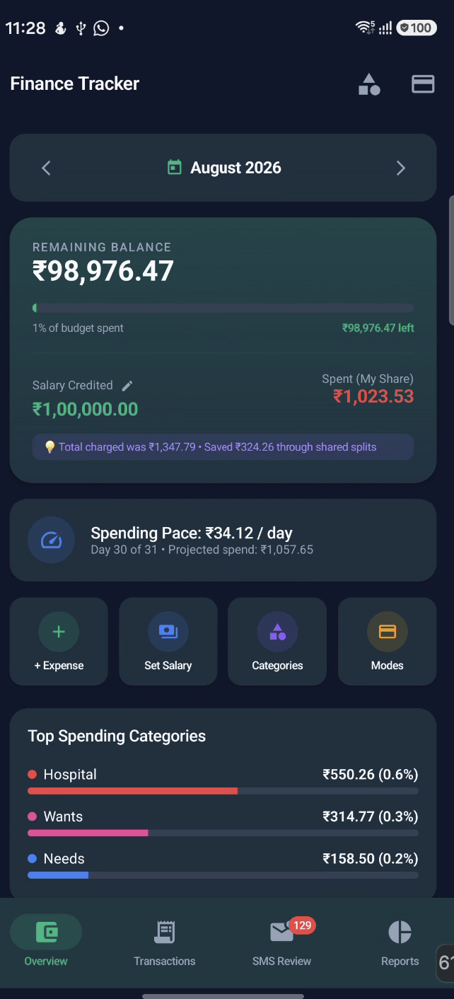
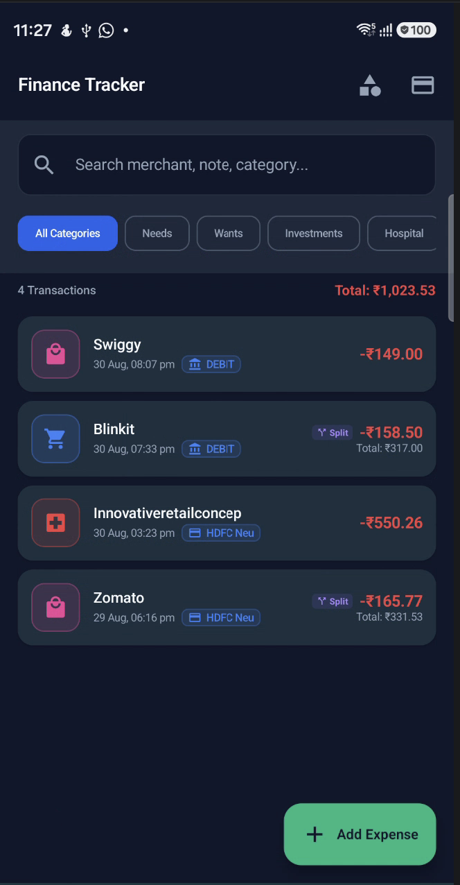
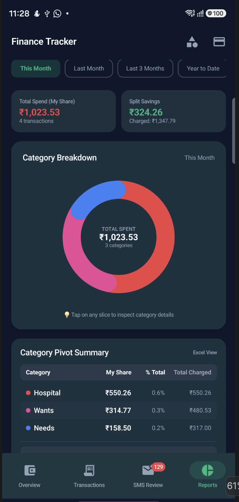

# Fintrace

**A native Android finance tracker that turns banking SMS alerts into reviewed transactions and makes shared expenses easier to understand.**

Built with Kotlin, Jetpack Compose, Material 3, and Room. Fintrace processes messages on the device, keeps your personal share separate from the full bill, and brings income and spending into a monthly dashboard. No bank login or backend account is required.

[Getting started](#getting-started) · [Architecture](docs/ARCHITECTURE.md) · [Testing](TESTING_GUIDE.md) · [Contributing](CONTRIBUTING.md) · [Privacy](PRIVACY.md)

## A look inside

| Monthly dashboard | Transaction history | Spending analytics |
| --- | --- | --- |
|  |  |  |

These repository screenshots illustrate the app; newer controls may differ from the captured version.

## What it does

- **Review banking alerts:** Import supported SMS formats into Pending Review, then confirm or dismiss them. Dismissed messages stay excluded from rescans and can be restored for review.
- **Track your share:** Record the full bill and individual split amounts. Spending uses your share; reports retain the original amount.
- **Budget monthly income:** Confirmed income becomes the month's salary total. Manual salary is a fallback when there is no positive confirmed income total.
- **Browse by month:** Navigate history by month and search or filter within the selected period.
- **Organize expenses:** Manage categories, icons, colors, and payment modes.
- **Explore spending:** View category charts, payment-mode breakdowns, spending pace, and split amounts owed.
- **Export a report:** Save an `.xlsx` expense report through Android's file picker.
- **Choose light or dark:** Switch themes from the app bar; your choice persists across restarts.

The parser includes examples for Indian banking alerts such as ICICI, HDFC, and UPI messages. Support is based on message patterns, not a direct bank integration.

## Engineering highlights

A shared purchase has two useful numbers: what was charged and what you personally spent. Fintrace models both, while giving users a review step between SMS detection and financial totals.

The implementation demonstrates declarative Compose screens, custom Canvas charts, reactive ViewModel state with coroutines and Flow, Room relationships and SQL aggregates, transactional split writes, Android SMS integration, and spreadsheet generation using the document picker.

See the [architecture walkthrough](docs/ARCHITECTURE.md) for code organization, implementation choices, and tradeoffs.

## Getting started

### Requirements

- JDK 17 and Android SDK Platform 34.
- Android Studio for SDK/device setup, or an existing command-line Android SDK installation.
- An emulator or test device running Android 8.0 / API 26 or later.

The wrapper is included: Gradle 8.7, Android Gradle Plugin 8.4.2, and Kotlin 1.9.22 are configured in the project.

### Build and run

```bash
git clone https://github.com/MrigankSingh10/Fintrace.git
cd Fintrace
./gradlew assembleDebug
```

Before building, open the project in Android Studio to configure the SDK location. For a terminal-only setup, create an ignored `local.properties` file containing `sdk.dir=/absolute/path/to/Android/sdk`.

The APK is generated at `app/build/outputs/apk/debug/app-debug.apk`. On Windows, use `gradlew.bat` instead of `./gradlew`.

With one emulator running and Android platform-tools on your PATH:

```bash
adb -e install -r app/build/outputs/apk/debug/app-debug.apk
```

Open Fintrace, grant SMS permissions to test import, and send a synthetic message:

```bash
adb -e emu sms send 5551234 "ICICI Bank Acct XX123 debited for Rs 250.00; Demo Shop credited. Ref DEMO001"
```

Find it in Pending Review and confirm it to include it in spending. Use a different reference for each new example: identical SMS bodies are treated as duplicates.

Use a dedicated emulator for development. Debug and release currently share `com.fintrace.app`; a debug install is not automatically isolated from a daily-use installation. See the [testing guide](TESTING_GUIDE.md) for setup and troubleshooting.

## How totals work

| Item | Current behavior |
| --- | --- |
| Pending or dismissed SMS | Excluded from financial totals |
| Confirmed expense | Personal share contributes to spending; full bill is retained for split reporting |
| Confirmed income | Contributes to monthly salary; category/payment-mode badges are hidden |
| Manual salary | Used when there is no positive confirmed income total; not added on top of income |
| In-app category percentage | Category personal-share expense divided by the salary/income denominator |
| Manual transaction | Saving the form currently confirms it directly |

Donut slice sizes and Excel category percentages currently describe shares of spending, while displayed in-app category percentages use salary. See [known limitations](docs/ARCHITECTURE.md#known-limitations-and-next-steps).

## Testing

```bash
./gradlew testDebugUnitTest
./gradlew assembleDebug
```

Local tests cover selected SMS formats, basic split calculations, month boundaries, and status conversion. Reports are generated at `app/build/reports/tests/testDebugUnitTest/index.html`.

UI, database persistence, and device-specific SMS behavior still need emulator/device verification. Follow the [manual checklist](TESTING_GUIDE.md#feature-verification-checklist).

## Privacy and project status

Fintrace has no app backend or declared Internet permission. Imported SMS text and transactions are stored in Room. **Android backup and device-transfer rules include that database**, and exported reports go to the destination selected by the user. Local storage does not mean application-level encryption. Read [PRIVACY.md](PRIVACY.md).

This is an actively developed personal project. Parser coverage, safe database migrations, and end-to-end tests are improvement areas documented in [ARCHITECTURE.md](docs/ARCHITECTURE.md).

## Contribute or get in touch

Bug reports, synthetic SMS examples, tests, and UI improvements are welcome. Start with [CONTRIBUTING.md](CONTRIBUTING.md). Report vulnerabilities privately using [SECURITY.md](SECURITY.md).

Created by [Mrigank Singh](https://github.com/MrigankSingh10). Project inquiries: [mrigank2303239@gmail.com](mailto:mrigank2303239@gmail.com).

## License

Fintrace is licensed under **GPL-3.0-or-later**. See [LICENSE](LICENSE) for the existing terms.
